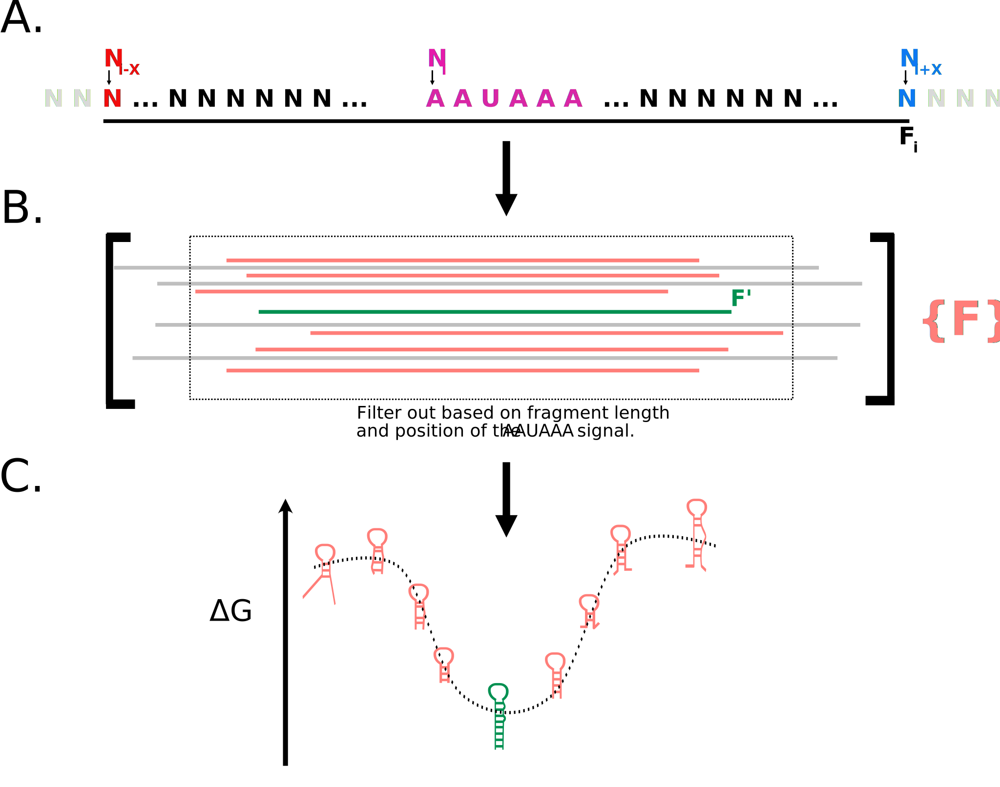
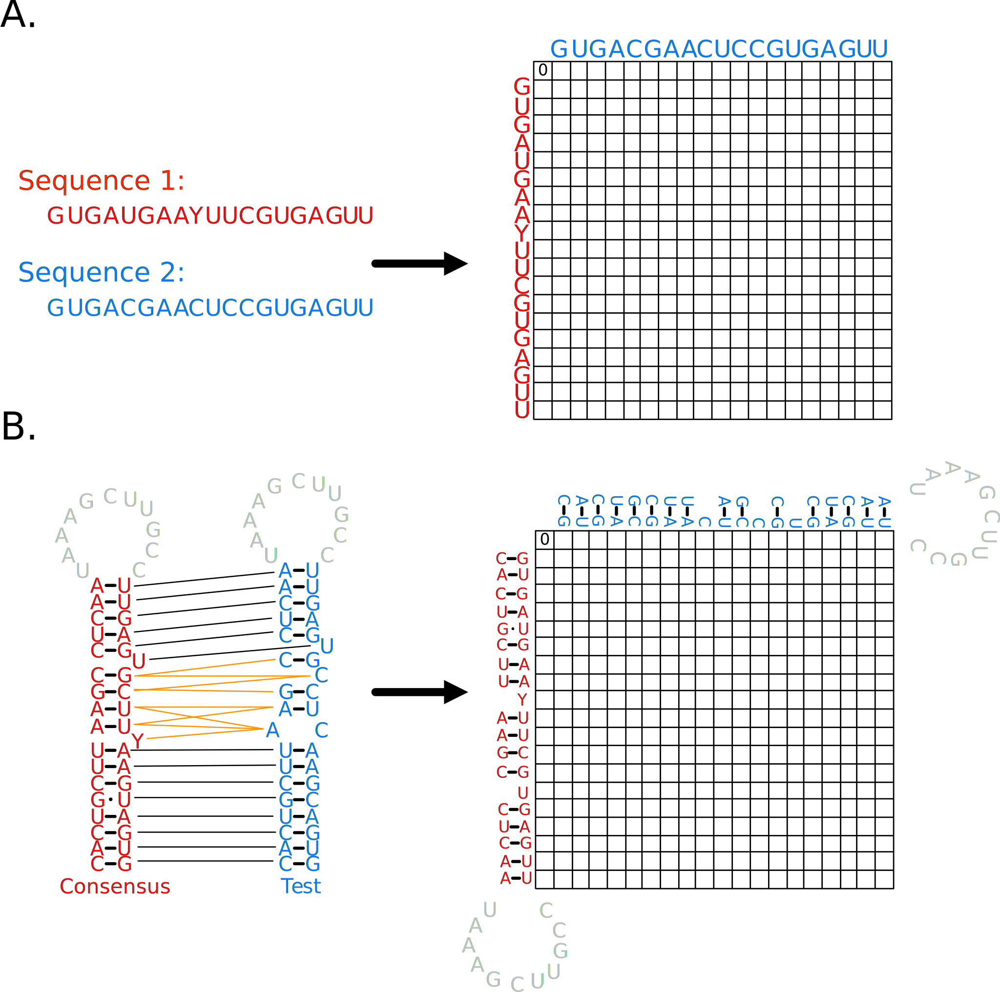

# hiv_polyA_struct_phylo_analysis

### Goal: to analyze the structural conservation of the 5' polyA hairpin the HIV genome.

Code used for the analysis in [insert paper citation/title]

#### Pipeline
There are three main components of the pipeline and each is seperated into a seperate directory in the repository. Each component is described further. 

- polyA_detection
- make_tree-post_detection_analysis
- concensus_structure-post_detection_analysis

---
## polyA_detection
Goal: Parse out the putative polyA hairpin from a set of target HIV genomes using de novo discovery method described below. 



Requirements: `viennaRNA`, `clustalo`

Input file (parameters are explained in '<< >>' - do not include brackets in file when running):
```json
{
    "paths": {
        "full_genomes_path": ""<<Path to a JSON file with the target genomes. See example for input format.>>,
        "rna_fold_path": ""<<Path to viennaRNA executable (RNAfold)>>,
        "clustal_path": "" <<Path to clustalo executable>>
    },
    "initial_seg": {
        "ext_range": 75 <<# of basepairs to extend up and down stream from the AAUAAA signal to pull the initital fragment to pull the polyA from>>
    },
    "minimization": {
        "min_len": 35, <<Minimum length of fragment to be conisdered a potential putative polyA hairpin>>
        "max_len": 50, <<Maximum length of fragment to be conisdered a potential putative polyA hairpin>>
        "max_unbp_ratio": 0.45, <<Ratio representing the max percentage of unbase paired residues>>
        "hwd_limit": 0.25 <<A restraint on how far from the center of the hairpin the AAUAAA can be for a potential putative polyA hairpin.>>
    },
    "output": {
        "folder": "../output/", << >>
        "polyA_output": "polyA.fasta" << >>
    },
    "strains_force_include":["KM390026", "K03455", "AB286862", "U51188", "X04415", "MH705144", "AB485658", "MH705163", "KC156211"] <<Strains that will be forced into the final output - regardless of whether or not they are represenative of their subtype.>>
}

```

This will output representative strains from the major HIV subtypes. 

## make_tree-post_detection-analysis
Goal: Using the output from the polyA detection to construct an annotated phylogenetic tree.

Requirements: `phyml`, `clustalo`

Input file (parameters are explained in '<< >>' - do not include brackets in file when running):

```json
{   
    "paths":{
        "strain_info":"" <<Path to the output from the polyA detection pipeline.>>
    },
    "alignment_tree": {
        "clustal_path": "", <<Path to the clustalo exectuable.>>
        "phyml_path": "" <<Path to the phyml executable>>
    },
    "params":{
        "bootstrap":1, <<# of bootstrap replicates for the MLH tree>>
        "phylo_gene":"env" <<Target gene to be used to construct the phylogeny>>
    }
}
```

This will output a SVG with the tree. 

## concensus_structure-post_detection_analysis
Goal: Using the output from the polyA detection to determine the concensus structure and visualize the variation via frequency plot. 

Note: the concensus structure is determined using the locarna package. 

Input file (parameters are explained in '<< >>' - do not include brackets in file when running):

```json
{   
    "concensus_sequence":"CACUGCUUAAGCCUCAAUAAAGCUUGCCUUGAGUGCUUHAAGURGUG", <<Concensus sequence outputted by locarna - ignoring gaps>>
    "concensus_vstr":"(((((((((((((((((...........))))).)))).))))))))", << Vstr for the concensus sequence outputted by locarna - ignoring gaps>>
    "target_strains_path":"", <<Path to the JSON file with all the strains to be used in the frequency calculations>>
    "colors":{"AU": "#f5c31d", "GC": "#3e4b94", "GU": "#852a2a"} <<Colors to use for the occurence of each base pair type in the frequecy bars>>
}
```

This will output a SVG with a bar per position of the hairpin alignments showing the frequncy of each base pair type that is present there. 

Note: Hairpins are aligned and compared using a modified Needleman-Wunch algorithm. See paper methods for more details.




---

## Usage
Set up a conda environment using the `mfs_lab.yml` configuration file. The usage for each component of the pipline follows the format `[main_file].py input.json`

